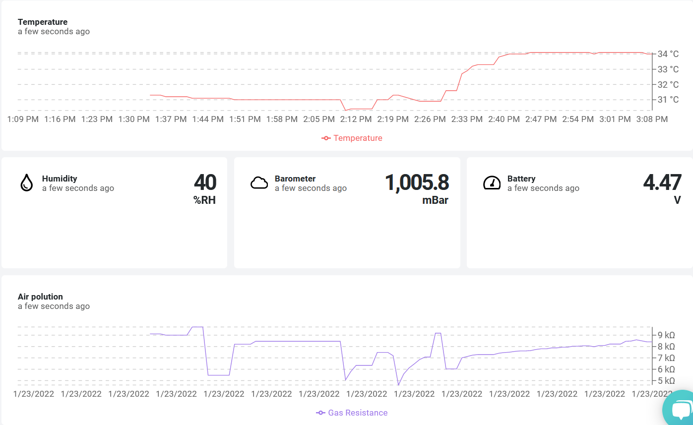

# WisBlock RAK11310 Environment Sensor

|  |  |   
| :-: | :-: |    

Environment Sensor _**Built With RAK WisBlock**_ modules.  

----

# Background
There are not many examples available for the RAK11310 that include    
- Attempt for low power consumption
- Supporting both LoRa P2P and LoRaWAN
- Have an AT Command Interface for easy setup
- Store the settings and credentials in the device

To give an easy start, I wrote this small example that includes all of above features.

The following **RAKWireless WisBlock** modules were used to build this Environment Sensor.    
- **RAK5005-O & RAK11310** ==> The base board, battery supply, solar charger, MCU with LPWAN capability
- **RAK1906** ==> Environment sensor based on the Bosch BME680

----

# Power consumption
The application is _"sleeping"_ as much as possible, waiting for a signal coming from the timer when it is time to do a measurement and send the data. The measured power consumption in _"sleep mode"_ is 28mA which is not perfect and needs some improvements. But at this time the Arduino-MBed BSP does not support the sleep modes of the RP2040 :-(. So actually, the cores of the RP2040 are not really entering sleep mode and continue to run with high power consumption.

----

# Dataflow
The sensor wakes up every 1 minute (configurable) and measures the temperature, humidity, barometric pressure and gas resistence (can be used to calculate Air Quality Index). The application packs the data into a data package in [Cayenne LPP format](https://community.mydevices.com/t/cayenne-lpp-2-0/7510) that includes:    
- Temperature ( channel 01, id 0x68 )
- Humidity ( channel 02, id 0x67 )
- Barometric pressure (chanel 03, id 0x73 )
- Gas resistance (channel 04, id 0x02)
- Battery status (channel 05, id 0x02)

The data format is
```c++
uint8_t data_flag2 = 0x01; // 1 LPP Channel 01
uint8_t data_flag3 = 0x67; // 2 LPP Humidity value
uint8_t temp_1 = 0;		   // 3
uint8_t temp_2 = 0;		   // 4
uint8_t data_flag0 = 0x02; // 5 LPP Channel 02
uint8_t data_flag1 = 0x68; // 6 LPP Humdity value
uint8_t humid_1 = 0;	   // 7
uint8_t data_flag4 = 0x03; // 8 LPP Channel 03
uint8_t data_flag5 = 0x73; // 9 LPP Barometer value
uint8_t press_1 = 0;	   // 10
uint8_t press_2 = 0;	   // 11
uint8_t data_flag6 = 0x04; // 12 LPP Channel 04
uint8_t data_flag7 = 0x02; // 13 LPP analog value
uint8_t gas_1 = 0;		   // 14
uint8_t gas_2 = 0;		   // 15
uint8_t data_flag8 = 0x05; // 16 LPP Channel 05
uint8_t data_flag9 = 0x02; // 17 LPP analog value
uint8_t batt_1 = 0;		   // 18
uint8_t batt_2 = 0;		   // 19
```

The data is sent as a LPWAN packet over a [LoRaWAN gateway](https://store.rakwireless.com/collections/wisgate-edge) to a LoRaWAN server. In this example I used my local Chirpstack LPWAN server, but it can be as well a TTN V3 server, the Helium Console or any other LNS.

The Chirpstack LPWAN server has two integrations enabled:
- Datacake. Instructions can be found in [Chirpstack to Datacake tutorial](https://news.rakwireless.com/how-to-visualize-your-sensor-data-on-datacake-using-chirpstack-server/)
- Cayenne LPP MyDevices    

Example data from Datacake:


----

# Hardware used
- [RAK11310](https://docs.rakwireless.com/Product-Categories/WisBlock/RAK11310/Overview/) WisBlock Core module
- [RAK5005-O](https://docs.rakwireless.com/Product-Categories/WisBlock/RAK5005-O/Overview/) WisBlock Base board
- [RAK1906](https://docs.rakwireless.com/Product-Categories/WisBlock/RAK1906/Overview) WisBlock Environment sensor

----

# Software used
- [PlatformIO](https://platformio.org/install)
- [RP2040 BSP](https://docs.platformio.org/en/latest/boards/#raspberry-pi-rp2040)
- [Patch to use RAK11310 with PlatformIO](https://github.com/RAKWireless/WisBlock/tree/master/PlatformIO)
- [SX126x-Arduino LoRaWAN library](https://github.com/beegee-tokyo/SX126x-Arduino)
- [Adafruit BME680 Library](https://registry.platformio.org/libraries/adafruit/Adafruit%20BME680%20Library)

## _REMARK_
The libraries are all listed in the **`platformio.ini`** and are automatically installed when the project is compiled.

----

# Setting up LoRaWAN credentials
The LoRaWAN settings can be defined in two different ways. 
- Over USB with [AT Commands](./AT-Commands.md)
- Hardcoded in the sources (_**ABSOLUTELY NOT RECOMMENDED**_)

## 1) Setup over USB port
Using the AT command interface the WisBlock can be setup over the USB port.

A detailed manual for the AT commands are in [AT-Commands.md](https://github.com/beegee-tokyo/WisBlock-API/blob/main/AT-Commands.md) (_**external link**_)

Here is an example for the typical AT commands required to get the device ready (EUI's and Keys are examples):
```log
// Setup AppEUI
AT+APPEUI=70b3d57ed00201e1
// Setup DevEUI
AT+DEVEUI=ac1f09fffe03efdc
// Setup AppKey
AT+APPKEY=2b84e0b09b68e5cb42176fe753dcee79
// Set automatic send frequency in seconds
AT+SENDFREQ=60
// Set data rate
AT+DR=3
// Set LoRaWAN region (here US915)
AT+BAND=8
// Reset node to save the new parameters
ATZ
// After reboot, start join request
AT+JOIN=1,0,8,10
```

## _REMARK_
The AT command format used here is _**NOT**_ compatible with the RAK5205/RAK7205 AT commands.

## 2) Hardcoded LoRaWAN settings
`void api_set_credentials(void);`
This informs the API that hard coded LoRaWAN credentials will be used. If credentials are sent over USB or from My nRF Toolbox, the received credentials will be ignored. _**It is strongly suggest NOT TO USE hard coded credentials to avoid duplicate node definitions**_    
If hard coded LoRaWAN credentials are used, they must be set before this function is called. Example:    
```c++
g_lorawan_settings.auto_join = false;							// Flag if node joins automatically after reboot
g_lorawan_settings.otaa_enabled = true;							// Flag for OTAA or ABP
memcpy(g_lorawan_settings.node_device_eui, node_device_eui, 8); // OTAA Device EUI MSB
memcpy(g_lorawan_settings.node_app_eui, node_app_eui, 8);		// OTAA Application EUI MSB
memcpy(g_lorawan_settings.node_app_key, node_app_key, 16);		// OTAA Application Key MSB
memcpy(g_lorawan_settings.node_nws_key, node_nws_key, 16);		// ABP Network Session Key MSB
memcpy(g_lorawan_settings.node_apps_key, node_apps_key, 16);	// ABP Application Session key MSB
g_lorawan_settings.node_dev_addr = 0x26021FB4;					// ABP Device Address MSB
g_lorawan_settings.send_repeat_time = 120000;					// Send repeat time in milliseconds: 2 * 60 * 1000 => 2 minutes
g_lorawan_settings.adr_enabled = false;							// Flag for ADR on or off
g_lorawan_settings.public_network = true;						// Flag for public or private network
g_lorawan_settings.duty_cycle_enabled = false;					// Flag to enable duty cycle (validity depends on Region)
g_lorawan_settings.join_trials = 5;								// Number of join retries
g_lorawan_settings.tx_power = 0;								// TX power 0 .. 15 (validity depends on Region)
g_lorawan_settings.data_rate = 3;								// Data rate 0 .. 15 (validity depends on Region)
g_lorawan_settings.lora_class = 0;								// LoRaWAN class 0: A, 2: C, 1: B is not supported
g_lorawan_settings.subband_channels = 1;						// Subband channel selection 1 .. 9
g_lorawan_settings.app_port = 2;								// Data port to send data
g_lorawan_settings.confirmed_msg_enabled = LMH_UNCONFIRMED_MSG; // Flag to enable confirmed messages
g_lorawan_settings.resetRequest = true;							// Command from BLE to reset device
g_lorawan_settings.lora_region = LORAMAC_REGION_AS923_3;		// LoRa region
// Inform API about hard coded LoRaWAN settings
api_set_credentials();
```

_**REMARK!**_    
Hard coded credentials must be set in `void setup_app(void)`!

----

# Packet data format
The packet data is in Cayenne LPP format. Every time the sensor data are collected, they are stored in a structure that is build in a format that most LPWAN servers and Integrations can easily parse. See [Dataflow](#dataflow) for details of the packet data format.

----

# Compiled output
The compiled files are located in the [./Generated](./Generated) folder. Each successful compiled version is named as      
**`WisBlock_Weather_Vx.y.z_YYYY.MM.dd.hh.mm.ss`**    
x.y.z is the version number. The version number is setup in the [./platformio.ini](./platformio.ini) file.    
YYYY.MM.dd.hh.mm.ss is the timestamp of the compilation.

PIO creates as well an **`.uf2`** file. This file contains the firmware and you can flash it simply to the RAK11310 by dragging it into the UF2 folder that is opened when the RAK11310 is started in boot mode (keep boot button pushed while powering up the device)

----

# Debug options 
Debug output can be controlled by defines in the **`platformio.ini`**    
_**LIB_DEBUG**_ controls debug output of the SX126x-Arduino LoRaWAN library
 - 0 -> No debug outpuy
 - 1 -> Library debug output (not recommended, can have influence on timing)    

_**APP_DEBUG**_ controls debug output of the application itself
 - 0 -> No debug outpuy
 - 1 -> Application debug output

## Example for no debug output and maximum power savings:

```ini
[env:rak11300]
platform = raspberrypi
board = rak11300
framework = arduino
build_flags = 
	-DSW_VERSION_1=1 ; major version increase on API change / not backwards compatible
	-DSW_VERSION_2=0 ; minor version increase on API change / backward compatible
	-DSW_VERSION_3=0 ; patch version increase on bugfix, no affect on API
	-DAPP_DEBUG=0
lib_deps = 
	beegee-tokyo/SX126x-Arduino
	adafruit/Adafruit BME680 Library
extra_scripts = pre:rename.py```